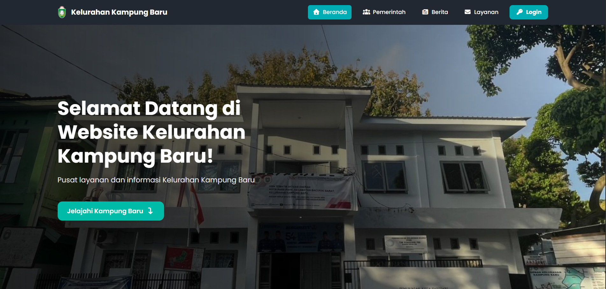

## 📌 Overview

This project is the official digital platform for Kampung Baru Subdistrict Office.  
It provides public information services and administrative document submission for residents.

The application is developed using the Laravel framework and follows modern web development standards.

---

## 📸 Application Preview

<p align="center">
  
</p>

## 🚀 Main Features

- Public information portal
- Online document submission system
- Administrative dashboard (Filament)
- Secure authentication
- File upload handling
- Responsive UI design
- Production-ready deployment

---

## 🛠 Built With


---

## 📋 System Requirements

- PHP 8.1 or higher
- Composer
- MySQL / MariaDB
- Node.js & NPM (if compiling assets)
- Web Server (Nginx / Apache)
- Docker (optional for containerized setup)

## ⚙️ Installation

### 1️⃣ Clone Repository

```
git clone https://github.com/RedSky09/kampungbaru-website.git
cd kampungbaru-website
```

### 2️⃣ Install Dependencies

```
composer install
```

If using Node (if frontend assets are present):

```
npm install
npm run build
```

### 3️⃣ Environment Setup

Copy environment file:

```
cp .env.example .env
```

Generate application key:

```
php artisan key:generate
```

Configure database credentials inside `.env`.

### 4️⃣ Database Migration

```
php artisan migrate
```

(Optional if seeder exists)

```
php artisan db:seed
```

### 5️⃣ Storage Link

If file upload is enabled:

```
php artisan storage:link
```

### 6️⃣ Run Development Server

```
php artisan serve
```

Application will be available at:

```
http://127.0.0.1:8000
```

## 🐳 Docker Setup (Optional)

Build and start containers:

```
docker-compose up -d --build
```

Run migration inside container:

```
docker exec -it <container_name> php artisan migrate
```

## 🔐 Environment Variables

Make sure to configure:

- APP_NAME
- APP_ENV
- APP_KEY
- DB_HOST
- DB_DATABASE
- DB_USERNAME
- DB_PASSWORD
- MAIL settings (if enabled)

⚠️ Never commit `.env` file to version control.

---

## 📂 Project Structure

```
app/
bootstrap/
config/
database/
public/
resources/
routes/
storage/
```

---

## 🌍 Production Deployment

This application is deployed on:

https://kampungbarukel.pareparekota.go.id

Server environment:

- Linux Server
- PHP 8+
- Composer
- MySQL
- Cloudflare Protection

---
