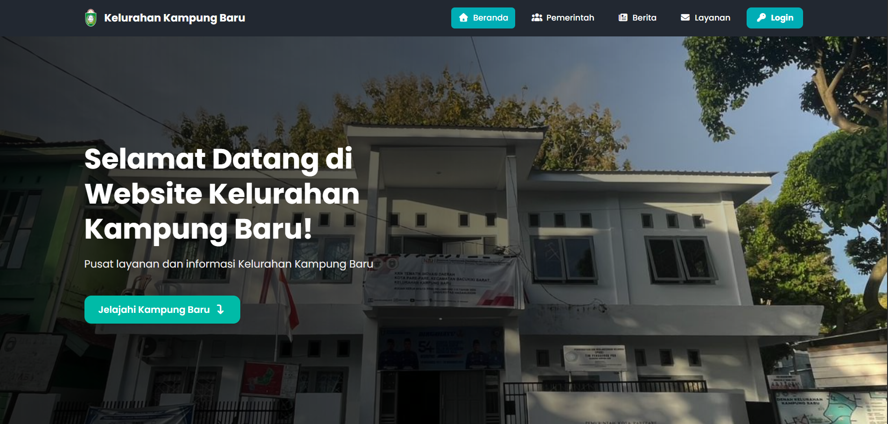

# 🏘️ Sistem Informasi Layanan Kelurahan Kampung Baru

## 📌 Overview
This project is the official digital platform for **Kelurahan Kampung Baru**, Kecamatan Bacukiki Barat, Kota Parepare.
It provides public information services and an online administrative document submission system for residents, replacing manual queue-based processes at the subdistrict office.

Developed as part of the **KKN (Kuliah Kerja Nyata) Program**, this application follows modern web development standards using the Laravel framework.

---

## 📸 Application Preview
<p align="center">
  
</p>

> ⚠️ Make sure the `screenshots/` folder is committed to the repository, otherwise this image will not render.

---

## 🚀 Main Features

- 🏠 **Public Information Portal** — homepage, government structure (visi & misi), officials directory
- 📰 **News/Berita Module** — publish and browse subdistrict news with pagination
- 📝 **Online Document Submission** — residents can request official letters:
  - Surat Keterangan Kematian
  - Surat Keterangan Pengantar Nikah
  - Surat Keterangan SKCK / Belum Menikah
  - Surat Keterangan Penguburan
- 🔍 **Submission Tracking** — track application status in real-time using a unique tracking code
- 📲 **WhatsApp Notifications** — automatic status updates sent via Fonnte API
- 🛠️ **Admin Dashboard (Filament v4)** — manage submissions, news, and officials data
- 📁 **File Upload Handling** — multi-document upload with validation
- 📱 **Responsive UI** — optimized for both mobile and desktop
- 🔐 **Secure Authentication** — Filament-based admin authentication
- 🐳 **Dockerized Setup** — containerized environment for consistent development
- ☁️ **Production-Ready Deployment** — currently live and deployed

---

## 🛠 Built With


---

## 📋 System Requirements

- PHP 8.1 or higher
- Composer
- Node.js & NPM (**required** — used to compile Tailwind CSS & Alpine.js assets via Vite)
- MySQL / MariaDB
- Web Server (Nginx / Apache)
- Docker & Docker Compose (optional, for containerized setup)

---

## ⚙️ Installation (Manual Setup)

### 1️⃣ Clone Repository
```bash
git clone https://github.com/RedSky09/kampungbaru-website.git
cd kampungbaru-website
```

### 2️⃣ Install Dependencies
```bash
composer install
npm install
npm run build
```

### 3️⃣ Environment Setup
Copy environment file:
```bash
cp .env.example .env
```

Generate application key:
```bash
php artisan key:generate
```

Configure database and third-party service credentials inside `.env` (see [Environment Variables](#-environment-variables) below).

### 4️⃣ Database Migration
```bash
php artisan migrate
```

Seed initial data (if seeder exists):
```bash
php artisan db:seed
```

### 5️⃣ Storage Link (Required)
Needed for uploaded files (news thumbnails, official photos, submission documents) to be publicly accessible:
```bash
php artisan storage:link
```

### 6️⃣ Create Admin Account
```bash
php artisan make:filament-user
```
Follow the interactive prompt to set the admin name, email, and password.

### 7️⃣ Run Development Server
```bash
php artisan serve
```

Application will be available at:
```
http://127.0.0.1:8000
```

Admin panel will be available at:
```
http://127.0.0.1:8000/admin
```

---

## 🐳 Docker Setup (Alternative)

Build and start containers:
```bash
docker-compose up -d --build
```

Run migration inside container:
```bash
docker exec -it <container_name> php artisan migrate
```

Create admin account inside container:
```bash
docker exec -it <container_name> php artisan make:filament-user
```

---

## 🔐 Environment Variables

Make sure to configure the following in your `.env` file:

| Variable | Description |
|----------|-------------|
| `APP_NAME` | Application name |
| `APP_ENV` | `local` for development, `production` for live server |
| `APP_KEY` | Auto-generated via `php artisan key:generate` |
| `APP_URL` | Base URL of the application |
| `DB_HOST` | Database host |
| `DB_DATABASE` | Database name |
| `DB_USERNAME` | Database username |
| `DB_PASSWORD` | Database password |
| `FONNTE_TOKEN` | API token for WhatsApp notifications ([fonnte.com](https://fonnte.com)) |
| `MAIL_*` | Mail configuration (optional, only if email notifications are enabled) |

⚠️ **Never commit the `.env` file to version control.** Use `.env.example` as a reference template only.

---

## 📂 Project Structure

```
app/
├── Models/              → Berita, Submission, Official
├── Http/Controllers/    → Public-facing page logic
├── Filament/            → Admin panel resources (CRUD)
└── Observers/           → Auto notification triggers

resources/
├── views/               → Blade templates (pages, components, layouts)
├── js/                  → JavaScript modules (form-handler, tracking, smooth-scroll, etc.)
└── css/                 → Tailwind CSS entry point

database/
└── migrations/          → Database schema definitions

routes/
└── web.php              → Application routes

docker/
└── nginx/               → Nginx configuration for containerized deployment
```

---

## 🌍 Production Deployment

This application is currently deployed at:
👉 https://kampungbarukel.pareparekota.go.id

**Server environment:**
- Linux Server (CWP-managed)
- PHP 8+
- MySQL
- Cloudflare (DNS & security layer)

---

## 🤝 Contributing / Handover Notes

This project was initially developed by **Alexander Mario Lefta** as part of the **KKN (Kuliah Kerja Nyata)** community service program, in collaboration with the **Kelurahan Kampung Baru** office.

If you are a new contributor continuing this project:
- Review the `Known Issues` / `Roadmap` section (if provided separately in handover documentation)
- Reach out to the previous maintainer for context on architectural decisions
- Please keep this README updated as new features are added

---

## 📄 License

This project is intended for internal government/institutional use by Kelurahan Kampung Baru. Please contact the maintainer before redistributing or reusing this codebase for other purposes.
